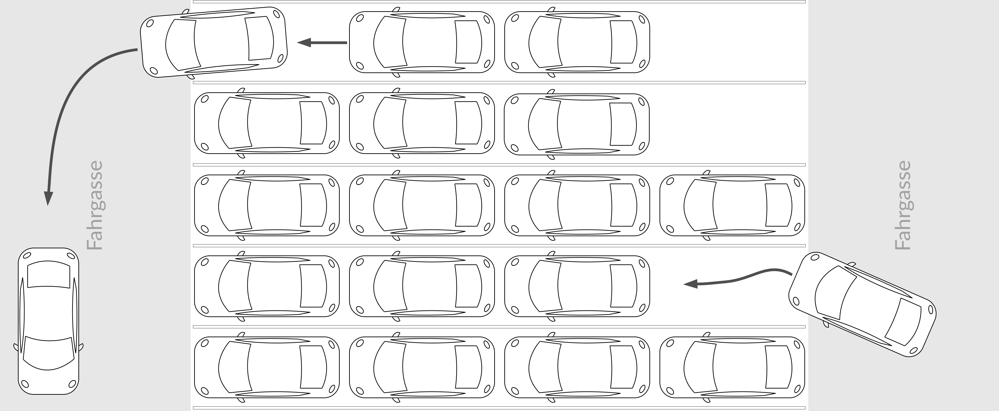

<a href="https://sumo.dlr.de/docs"><p align="center"></p></a>

Eclipse SUMO - Simulation of Urban MObility 
===========================================

What is this Fork about?
------------------------

This fork is based on ["Simulation of Urban MObility" (SUMO)](https://sumo.dlr.de/) an open source, highly portable, microscopic traffic simulation package designed to handle large road networks and different modes of transport.

It is mainly developed by employees of the [Institute of Transportation Systems at the German Aerospace Center](https://www.dlr.de/ts).

The fork expands the functionality of SUMO by features regarding automated valet parking and queue parking. This is mainly achieved by the implementation of new reroute doctrines as well as new features for parking areas. Do keep in mind this fork is in an experimental state and also that there is no NetEdit support for the new functions yet.


Automated Valet Parking
-----------------------

In addition to more simple parking assistance systems, there are also holistic approaches to parking management in the field of autonomous driving, such as autonomous valet parking: At a transfer point, the valet zone, the driver gets out of the vehicle and hands over the vehicle to the parking system by means of a signal via a smartphone app or similar. parking system. The vehicle is then assigned a parking space, which it finds and parks via V2I communication (vehicle to infrastructure) or by means of a fully autonomes approach.
Since an automated approach offers the possiblity of reparking vehicles new opportunities for optimization of space usage and charging area utilization arise:


Queue Parking
-------------

In the case of queue parking, vehicles are parked in queues without the parking space of each vehicle being accessible by means of a lane. At the start of the queue there is a lane for entering the queue and at its end there is a lane for exiting. Traditionally this parking layout is only used for case in which vehicles arrive and leave around the same time (e.g. parking for big events with a fixed starting and end time or on ferries). Highly automated vehicles offer a new use case for the layout, since reparking while the driver is not present is possible.




Charge optimization
-------------------

By reparking vehicles in combination with contactless or otherwise automatable charging coupling, the utilization of charging areas could be improved. Fully charged vehicles could be decoupled and moved to a normal parking space, while another vehicle with charging demand could be called to the charging area.


Build and Installation
----------------------

You can download the offical SUMO via the [downloads site](https://sumo.dlr.de/docs/Downloads.html) or clone the offical version via its Github repo and compile it yourself.

For Windows pre-compiled binaries and CMake files to generate Visual Studio projects are provided. If you want to develop under Windows, please also clone the dependent libraries using:

```
git clone --recursive https://github.com/DLR-TS/SUMOLibraries
```

This fork can be installed in the same way, by cloning and compiling the repo:

```
git clone --recursive https://github.com/maxschlachte/sumoAutomatedValetParking
sudo apt-get install cmake python g++ libxerces-c-dev libfox-1.6-dev libgdal-dev libproj-dev libgl2ps-dev swig
cd <SUMO_DIR> # please insert the correct directory name here
export SUMO_HOME="$PWD"
mkdir build/cmake-build && cd build/cmake-build
cmake ../..
make -j$(nproc)
```

For [detailed build instructions have a look at the Documentation](https://sumo.dlr.de/docs/Developer/Main.html#build_instructions).


Documentation
-------------

For any details on the usual SUMO features refer to the [offical documentation](https://sumo.dlr.de/docs/index.html).

subspace
--------

Subspaces are child elements of the [space](https://sumo.dlr.de/docs/Simulation/ParkingArea.html) element. Vehicles entering a space will continue moving into it's subspaces in definition order.

| Attribute Name | Value Type | Value Range | Default | Description |
|-------|-------|-------|-------|-------|
| x | float |  |  | The x-position in meters of the subspace |
| y | float |  |  | The y-position in meters of the subspace |
| z | float |  | 0 | The y-position in meters of the subspace |
| width | float | | width value of the parent space | The width of the subspace |
| length | float | | length value of the parent parking area | The length of the parking subspace |
| angle | float (degree) | | absolute angle of the parent parking area (lane angle + angle attribute) | Absolute angle of the subspace |
| slope | float (degree) | | 0 | 	Slope angle of the subspace |

space
-----

The space element receives a new attribut subspaces to generate subspaces without defining them one by one. Additionally charging attributes are added to the space element directly. This is based upon the [charging station](https://sumo.dlr.de/docs/Models/Electric.html) element and was implemented for convenience.

| Attribute Name | Value Type | Value Range | Default | Description |
|-------|-------|-------|-------|-------|
| subspaces | int | positive | 0 | amount of subspaces in the queue that are generated |
| power | float | positive | | Charging power |
| efficiency | float | 0.0 to 1.0 | 0.95 | efficiency factor of the charging process |
| chargeDelay | float | positive | 0 | Time delay after the vehicles have reached / stopped on the charging space, before the energy transfer (charging) is started |

parkingArea
-----------

In order to leave a [parking area](https://sumo.dlr.de/docs/Simulation/ParkingArea.html) to another lane than the one it was entered by, an additional attribute called exitLane is defined.

| Attribute Name | Value Type | Value Range | Default | Description |
|-------|-------|-------|-------|-------|
| exitLane | string | | | id of the lane vehicles should exit to |

parkingAreaReroute
------------------

In some situations it can be useful to have a priorization for certain parking areas when rerouting; e.g. electric vehicles should prioritize charging spaces. For this reason a new attribute is added to the [parkingAreaReroute](https://sumo.dlr.de/docs/Simulation/Rerouter.html) element.

| Attribute Name | Value Type | Value Range | Default | Description |
|-------|-------|-------|-------|-------|
| priority | float | positive | 0.0 | general priority of the parking area the parkingAreaReroute is pointing to; higher values are prioritized |

The weight for the priority parameter can be set in the vehicle definition as a param in the following way:

```
<param key="parking.priority.weight" value="1.0"/>
```

Device: eParkingReroute
-----------------------

To call a vehicle to a charging area that is free the new [device](https://sumo.dlr.de/docs/Developer/How_To/Device.html) eParkingReroute was implemented. It calls a vehicle that has entered a certain area to the charging area if another vehicle left. The eParkingReroute device must be defined for the vehicle type and its parameters must be set in the input area in the configuration file:

```
<input>
        <net-file value="network.net.xml"/>
        <route-files value="route.rou.xml"/>
        <additional-files value="additionals.add.xml"/>
        <device.eparkingreroute.begEdges value="my_entering_edge_1, my_entering_edge_2"/>
        <device.eparkingreroute.endEdges value="my_exit_edge_1, my_exit_edge_2"/>
        <device.eparkingreroute.maxCharge value="0.9"/>
        <device.eparkingreroute.prioritizeLowCharges value="1"/>
        <step-length value="0.5"/>
</input>
```

| Parameter Name | ValueType | Description |
|-------|-------|-------|
| device.eparkingreroute.begEdges | string[] | A list of edges. If any of these edges is passed by a vehicle with this device it is considered for calling to a free charging area. |
| device.eparkingreroute.endEdges | string[] | A list of edges. If any of these edges is passed by a vehicle with this device it is not longer considered for calling to a free charging area. |
| device.eparkingreroute.maxCharge | float | A percentile number at which a vehicle is no longer called to a charging area. |
| device.eparkingreroute.prioritizeLowCharges | boolean | Boolean for prioritizing vehicles with low charges on the call (1) or using the first come, first serve principle (0) |

To use this device define it in the appropriate vType like so:

```
<param key="has.eParkingReroute.device" value="true"/>
```

ATTENTION: Currently there is no reservation system for vehicles that are called. So vehicles that are routed to the charging space and arrive earlier might block a vehicle that is routed by this device's call.

Device: parkingInfo
-------------------

For recording parking related parameters the parkingInfo device is integrated. To use it, define the entry and exit edges of the parking facility in the configuration file and assign it to the vehicles. Additionally the tripinfo-ouput must be used:

```
<input>
        <net-file value="network.net.xml"/>
        <route-files value="route.rou.xml"/>
        <additional-files value="additionals.add.xml"/>
        <device.parkinginfo.begEdges value="my_entrance_1, my_entrance_2"/>
        <device.parkinginfo.endEdges value="my_exit_1, my_exit_2"/>
        <step-length value="0.5"/>
</input>
<output>
        <tripinfo-output value="ParkingInfo.out.xml"/>
</output>
```

This results in an additional child element parkingInfo in tripinfo:

```
<parkinginfo from="my_entrance_1" to="my_exit_2" begTime="105.50" endTime="7412.00" enteringTime="33.50" leavingTime="74.00" parkingDuration="7116.00" reparkingTime="98.50" totalEnergyCharged="20035.05" totalChargingTime="6975.50" totalBlockingTime="0.00"/>
```

| Parameter Name | ValueType | Description |
|-------|-------|-------|
| from | string | id of the edge over which the vehicle entered the parking facility |
| to | string | id of the edge over which the vehicle exited the parking facility |
| begTime | float | arrival timestamp at the from edge |
| endTime | float | arrival timestamp at the to edge |
| enteringTime | float | timespan for getting from the from edge to the (first) parking space |
| leavingTime | float | timespan for getting from the (last) parking space to the to edge |
| parkingDuration | float | timespan used for parking |
| reparkingTime | float | accumulated timespan used for all reparking (enteringTime and leavingTime are not considered in the reparkingTime) |
| totalEnergyCharged | float | total energy charged in W |
| totalChargingTime | float | total time used for charging (this overlaps with parkingDuration if charging spaces are used for charging) |
| totalBlockingTime | float | timespan in which the vehicle was blocking a charging space, meaning it was parking on the space although it was fully charged |